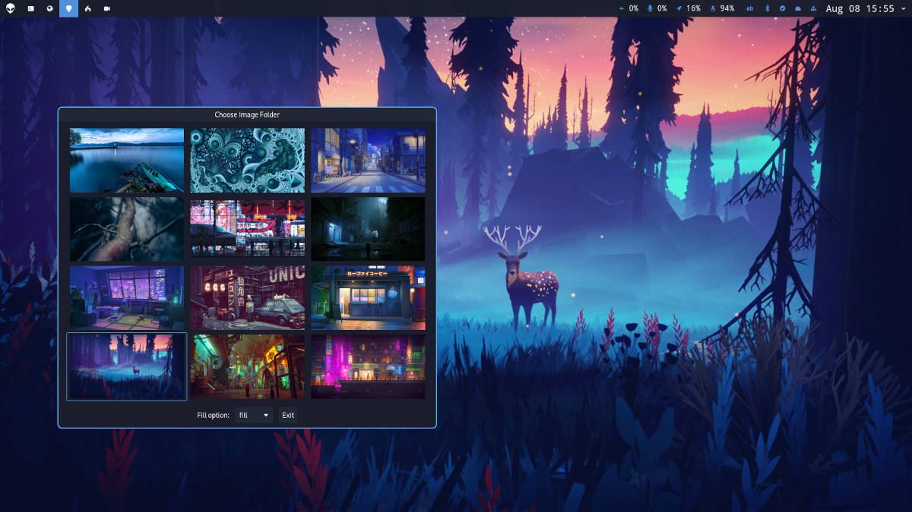

# Waypaper

GUI wallpaper setter for Wayland and Xorg window managers on Linux. It works as a frontend for popular wallpaper backends like `swaybg`, `swww`, `wallutils`, `hyprpaper` and `feh`. Developed by [Roman Anufriev](https://app.gitbook.com/o/hAqzIwC67MJSu3lFreUe/s/tcj89Kky0qwCogWefYcf/) since 2023.

<figure><figcaption></figcaption></figure>

### Features

* Vim keys
* Support for GIF animations (with `swww`)
* Support for multiple monitors (with `swww`)
* Works on Wayland (with `swww` or `swaybg` or `wallutils` or `hyprpaper`)
* Works on Xorg (with `feh` or `wallutils`)
* Restores wallpaper at launch of your WM
* Caching for fast loading

### Contents

* [Installation](installation.md)
* [Usage](usage.md)
* [Keybindings](keybindings.md)
* [Configuration](configuration.md)
* [Troubleshooting](troubleshooting.md)
* [Support and contribution](support-and-contribution.md)

### Demo



### Repositories

* Code: [https://github.com/anufrievroman/waypaper](https://github.com/anufrievroman/waypaper)
* Documentation: [https://github.com/anufrievroman/waypaper-docs](https://github.com/anufrievroman/waypaper-docs)

If you enjoy using Waypaper, please consider [supporting](support-and-contribution.md)  the project.

